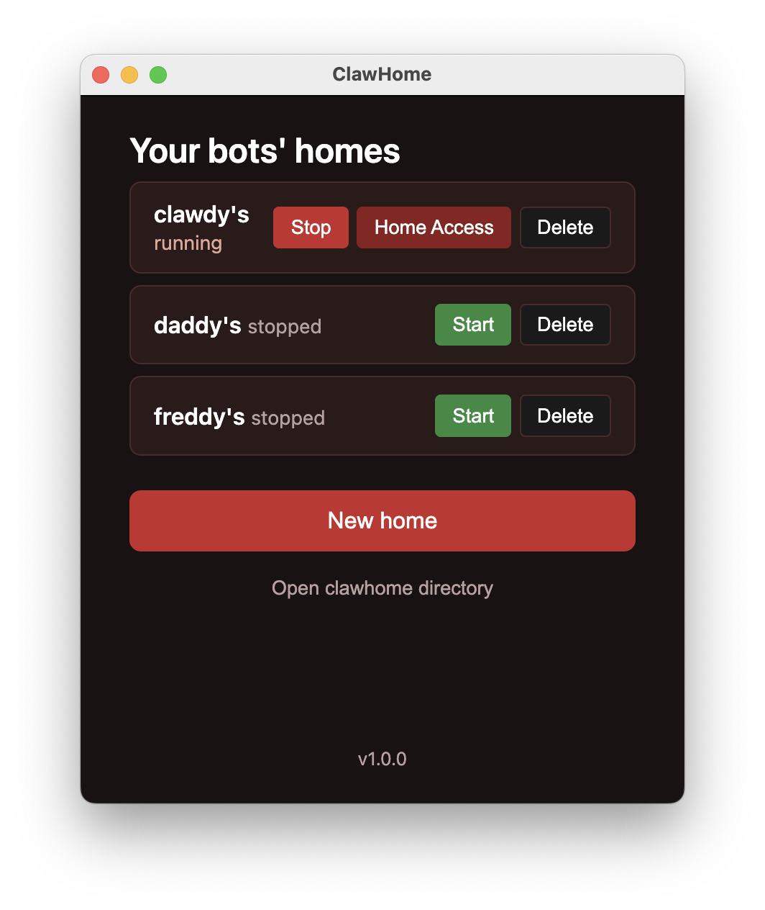
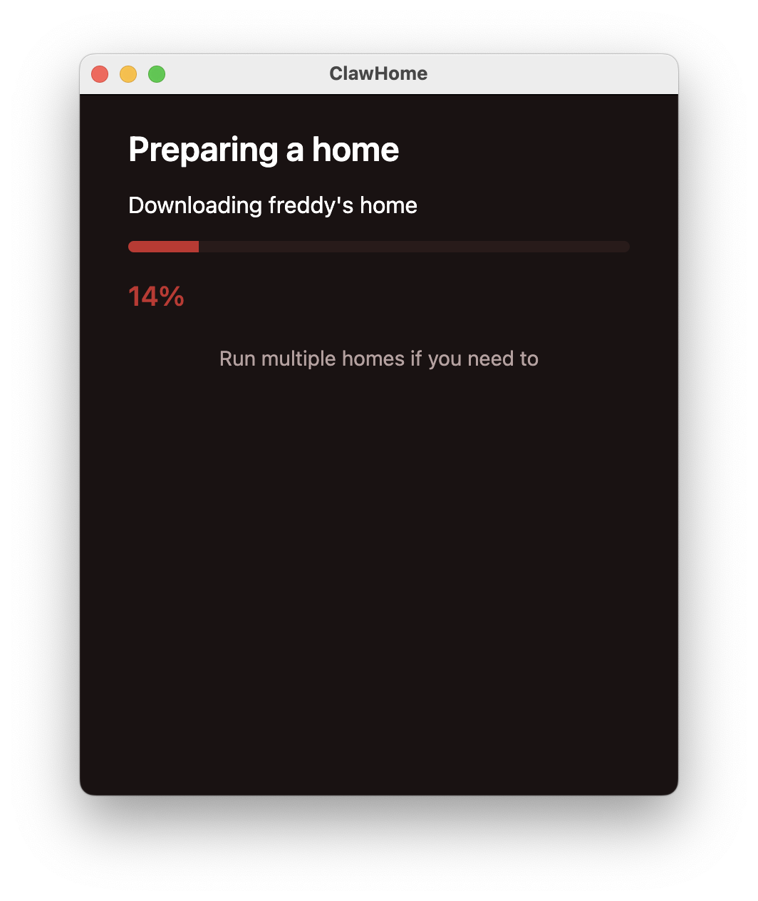
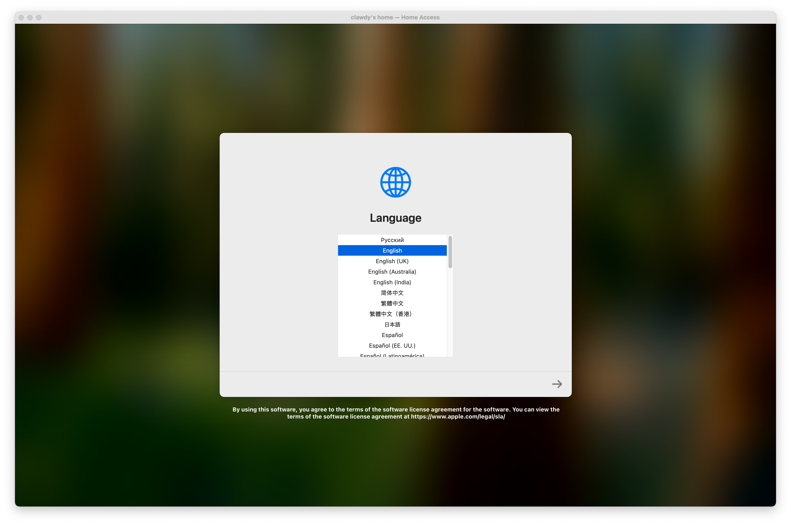
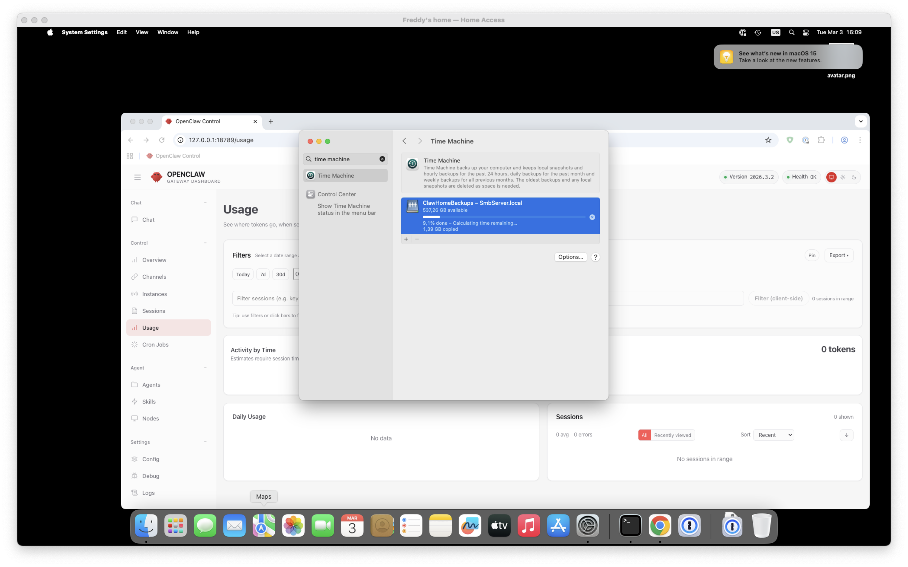

# ClawHome

**A private home for your Claw**

ClawHome is an app that builds secure virtual homes for your Claws directly on your Mac with click of a button.

You don't need to buy a separate mac anymore.

## Screenshots

**Your bots' homes** — List, start, stop, and access your homes.



**Preparing a home** — Automatic IPSW download and home creation.



**Home Access** — Full macOS guest in a window.



**Backups** — Time Machine backups, so in case it is ducked up, you can restore it easily



## Features

- **macOS VMs** — Create macOS guests with automatic IPSW download (latest supported) or use your own
- **Storage** — VMs live in `~/clawhome/homes/{name}/`
- **Shared directories** — Host folders accessible from the guest
- **Clipboard sync** — Copy and paste between host and guest

## Data locations

All data lives under `~/clawhome/` so it persists across app updates:

| Path | Purpose |
| ---- | ------- |
| `~/clawhome/homes/` | VM disk images and configs |
| `~/clawhome/backups/` | Backup destination (exposed via SMB when a VM is running) |
| `~/clawhome/Shared/` | Shared clipboard (guest mounts at /Volumes/My Shared Files) |
| `~/clawhome/userData/` | Electron app data (cookies, cache, etc.) |

## Directory sharing

When a VM is running, these host directories are shared and appear in the guest at `/Volumes/My Shared Files/`:

| Host path                      | Guest path                           | Writable |
| ------------------------------ | ------------------------------------ | -------- |
| `~/Downloads`                  | `/Volumes/My Shared Files/Downloads` | Yes      |
| `~/clawhome/Shared/clipboard` | `/Volumes/My Shared Files/clipboard` | Yes      |

## Backup and restore

ClawHome runs a built-in SMB backup server when at least one home is running. The `~/clawhome/backups` folder is exposed as a network share (**ClawHomeBackups**) so you can:

- **Time Machine** — Add the ClawHomeBackups share as a backup destination. Your homes will be backed up automatically alongside the rest of your data.
- **Transfer to another Mac** — Mount the share from another Mac on the same network (or via the VM’s NAT) and copy homes to the new machine.

Keep ClawHome open while backing up or transferring. The share is available at `192.168.64.1:8082` when a VM is running.

## Clipboard syncing

**Right-click dock icon → Paste to [name]'s home** — Copy on the host (Cmd+C), then right-click the VM icon in the dock and choose "Paste to [name]'s home" to paste into the guest.

## Requirements

- Apple Silicon Mac
- macOS 13 or later

## Build and run

```bash
./launch.sh
```

Or build for release:

```bash
./build.sh
```

Output is in `release/{version}/` (e.g. `release/1.0.0/`).

## Uninstall

1. Quit ClawHome if it is running.
2. Move the app to Trash (from Applications or wherever you installed it).
3. Remove the data folder:

   ```bash
   rm -rf ~/clawhome
   ```

## Project structure

```
clawhome/
├── electron/          # Electron main process, preload
├── src/               # Renderer UI
├── claw-vm/           # Swift VM backend (ClawVM)
└── scripts/           # Build scripts
```

## Acknowledgements

- [go-smb2](https://github.com/macos-fuse-t/go-smb2) — SMB server for the built-in backup share
